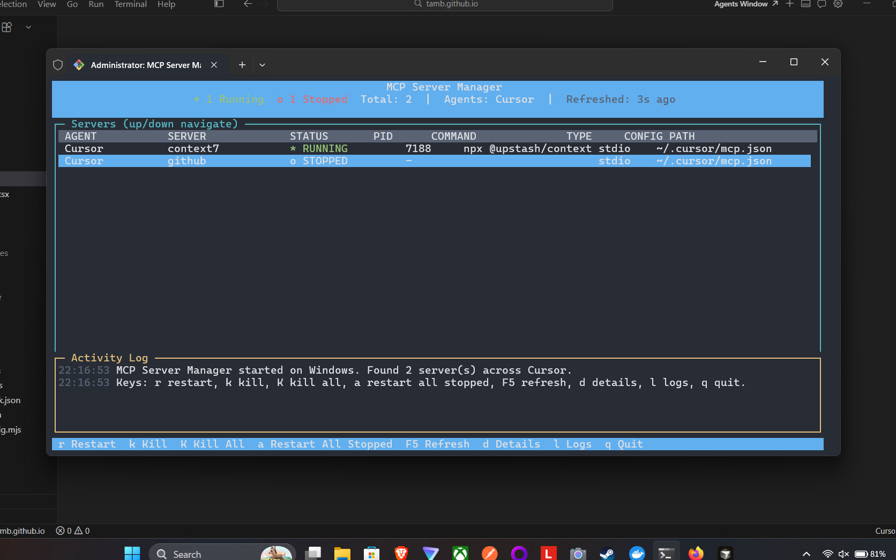
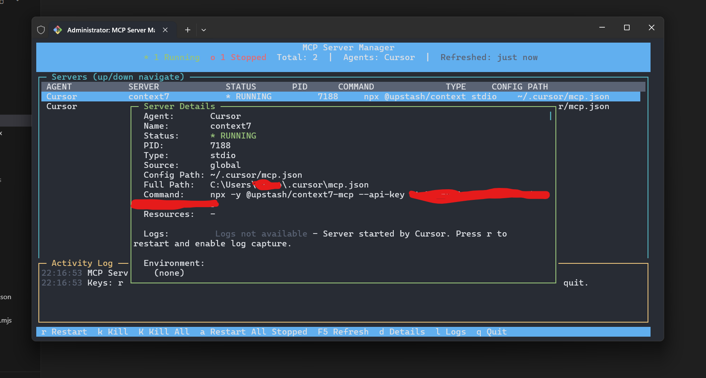
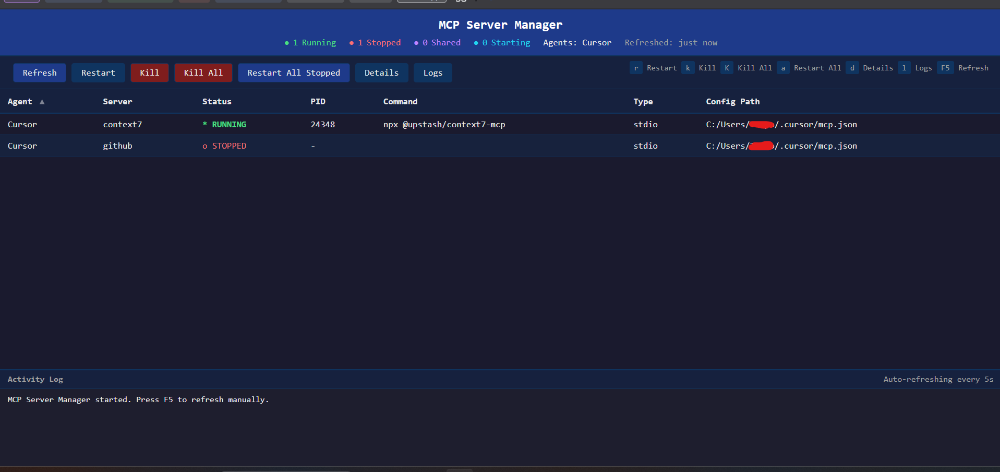

# simple-mcp-manager — MCP Server Manager

**Monitor and restart MCP (Model Context Protocol) servers** for Cursor, VS Code, Windsurf, Claude Desktop, Claude Code, and GitHub Copilot from one terminal. A lightweight TUI (terminal UI) and optional Web UI discover your MCP configs, show which servers are running or stopped, and let you kill or restart them—no install into any AI tool required.

[](https://www.npmjs.com/package/simple-mcp-manager) [](https://nodejs.org) [](https://opensource.org/licenses/MIT)

Works on **Windows**, **macOS**, **Linux**, and **WSL**.

## Table of contents

- [Screenshots](#screenshots)
- [Quick start](#quick-start-no-install)
- [What is this?](#what-is-this)
- [CLI reference](#cli-reference)
- [Supported tools \& config locations](#supported-tools--config-locations)
- [Terminal UI](#terminal-ui)
- [Web UI mode](#web-ui-mode)
- [How it works](#how-it-works)
- [Cross-platform behavior](#cross-platform-support)
- [Logging](#logging)
- [Troubleshooting](#troubleshooting)
- [Requirements](#requirements)
- [Contributing](#contributing)
- [Links](#links)

## Screenshots

**Terminal UI — server list with status, PID, command, and config path.**



**Terminal UI — Server Details view (press `d`).** Full command, paths, and masked sensitive values in environment where applicable.



**Web UI (`--ui`) — browser dashboard** with status summary, action toolbar, sortable server table, and activity log (auto-refresh in the browser).



## Quick start (no install)

Run with [npx](https://docs.npmjs.com/cli/v8/commands/npx)—no clone or global install needed:

```bash
# Terminal UI mode (default)
npx simple-mcp-manager

# Web UI — served at http://localhost:3000 by default
npx simple-mcp-manager --ui

# Web UI on a specific port
npx simple-mcp-manager --ui --port 8080
```

**Install globally:**

```bash
npm install -g simple-mcp-manager
mcp-manager                   # Terminal UI (default)
simple-mcp-manager --ui       # Web UI (either binary name works)
```

**Clone and run from source:**

```bash
git clone https://github.com/tamb/simple-mcp-manager.git
cd simple-mcp-manager
npm install
npm start                     # Terminal UI
npm run start:ui              # Web UI
```

## What is this?

A **standalone CLI** you run in a separate terminal. It is **not** an MCP server and does **not** need to be registered inside Cursor, VS Code, or other tools as an MCP entry. It **reads** the same config files those tools use and **matches** running processes on your machine so you can see and control local stdio-based servers from one place.

**It does:**

- Scan MCP config locations for all supported agents
- Show each configured server with run/stop (and related) status
- Offer **restart**, **kill**, **kill all running**, and **restart all stopped** for managed stdio processes
- Optionally serve a **browser UI** with the same operations and live refresh

**Limitations to be aware of:**

- **HTTP / HTTPS MCP endpoints** are listed for context but are not local processes you can kill or restart from this tool
- **Log capture** for a server is tied to processes the manager starts or restarts; servers already running before you open the manager may show “logs not available” until you restart them from the UI (see screenshots)
- Process matching is heuristic (command line, package names); unusual spawn setups may not classify perfectly

## CLI reference

| Mode | Command | Description |
|------|---------|-------------|
| TUI (default) | `simple-mcp-manager` | Full-screen terminal interface |
| Web UI | `simple-mcp-manager --ui` | HTTP server on localhost |
| Web UI port | `--ui --port <n>` | Preferred port (default **3000**); must be 1–65535 |

**Rules:**

- The Web UI flag must be **`--ui`** (there is no `-ui` shorthand).
- If the preferred port is busy, the server tries the next ports up (same behavior as before), within a limited range.
- **Bin names:** `mcp-manager` and `simple-mcp-manager` (see `package.json` `bin`).

## Supported tools & config locations

| Tool | Config locations |
|------|------------------|
| **Cursor** | `~/.cursor/mcp.json`, `%APPDATA%\Cursor\User\mcp.json`, per-project `~/.cursor/projects/*/mcp.json`, workspace `.cursor/mcp.json` |
| **VS Code** | `~/.vscode/mcp.json`, `%APPDATA%\Code\User\mcp.json` (Win), `~/Library/Application Support/Code/User/mcp.json` (Mac), `~/.config/Code/User/mcp.json` (Linux), workspace `.vscode/mcp.json` |
| **Windsurf** | `~/.codeium/windsurf/mcp_config.json`, `%APPDATA%\Windsurf\User\mcp_config.json` (Win), `~/Library/Application Support/Windsurf/User/mcp_config.json` (Mac), `~/.config/Windsurf/User/mcp_config.json` (Linux), workspace `.windsurf/mcp.json` |
| **Claude Desktop** | `%APPDATA%\Claude\claude_desktop_config.json` (Win), `~/Library/Application Support/Claude/claude_desktop_config.json` (Mac), `~/.config/claude/claude_desktop_config.json` (Linux) |
| **Claude Code** | `~/.claude/mcp.json`, `~/.claude.json`, workspace `.claude/mcp.json` |
| **GitHub Copilot** | `~/.mcp.json`, workspace `.mcp.json` |

Most tools use `{ "mcpServers": { ... } }`. GitHub Copilot and VS Code use `{ "servers": { ... } }`. The manager detects both shapes.

## Terminal UI

The TUI shows a sortable-style table (agent, server name, status, PID, command, type, config path), a short **Activity Log**, and a footer with shortcuts.

### Keybindings

| Key | Action |
|-----|--------|
| `r` | Restart the selected server |
| `k` | Kill the selected server |
| `K` | Kill all running servers |
| `a` | Restart all stopped servers |
| `F5` | Manual refresh |
| `d` | Server details modal |
| `l` | Logs (when applicable; from details or global shortcut) |
| Up / Down | Move selection |
| `q` | Quit |

Statuses use color and symbols (running, stopped, shared, HTTP, starting/stopping—see UI labels). Sensitive environment keys can be masked in detail views.

## Web UI Mode

Run with **`--ui`**. Open the URL printed in the terminal (by default **`http://localhost:3000`**, or the next free port if 3000 is taken).

Features mirror the TUI in the browser:

- Sortable server table with status colors
- Auto-refresh (5s typical, **15s on WSL**)
- Buttons: Refresh, Restart, Kill, Kill All, Restart All Stopped, Details, Logs
- Details and log modals; activity log pane
- Keyboard shortcuts aligned with the TUI (`r`, `k`, `K`, `a`, `d`, `l`, `F5`, arrows, Esc)

The page is self-contained HTML/CSS/JS—no bundler or extra assets needed.

### Port configuration

Prefer **`--port`**:

```bash
mcp-manager --ui --port 8080
```

Default port is **3000**. If unavailable, higher ports are tried automatically (bounded search).

## How it works

1. Enumerate known config paths per platform and workspace-relative files  
2. Parse `mcpServers` or `servers` entries  
3. Correlate configured commands with OS processes (`ps`, PowerShell on Windows/WSL paths, etc.)  
4. Refresh on an interval (**5 s**, or **15 s on WSL** to reduce expensive Windows process queries)  
5. Actions call into the same process start/kill helpers for stdio servers; HTTP entries are informational  

## Cross-platform support

| Feature | Windows | macOS | Linux | WSL |
|---------|---------|-------|-------|-----|
| Process detection | PowerShell | `ps aux` | `ps aux` | PowerShell (Windows processes) |
| Kill process | `taskkill /PID /F` (per PID) | `kill` SIGTERM/SIGKILL | `kill` SIGTERM/SIGKILL | `taskkill.exe /PID /F` |
| Spawn process | `shell: true` for `.cmd` | detached | detached | `cmd.exe /C` on Windows side when needed |

On **WSL**, the tool can observe MCP servers launched by Windows-hosted editors when those show up as Windows processes.

## Logging

Diagnostic output is appended to **`logs/<timestamp>-log.txt`** under the installed package directory (next to `index.js`). If the directory cannot be created, logging fails silently so the CLI still runs. Use these files when reporting bugs.

## Troubleshooting

| Issue | What to try |
|--------|--------------|
| No servers listed | Confirm configs exist and JSON is valid; check table paths above |
| Wrong or “unknown” status | Refresh (`F5`); ensure the MCP command matches how the agent starts the server |
| Cannot kill / restart | HTTP servers cannot be controlled locally; some shared/cluster PIDs need care—use Details to see linkage |
| Web UI won’t bind | Pick another `--port`; check firewall or conflicting apps |
| WSL feels slow | Shorter refresh is skipped on purpose (15s); run from native OS if you need faster polling |
| “Logs not available” | Restart that server once from this manager (`r`) so stderr/stdout hooks attach |

## Requirements

- **Node.js** >= 18  

## Contributing

See **[CONTRIBUTING.md](CONTRIBUTING.md)** for local development, **`npm link`**, packing with **`npm pack`**, and Pull Request workflow.

## Links

- **Repository:** [github.com/tamb/simple-mcp-manager](https://github.com/tamb/simple-mcp-manager)  
- **npm:** [simple-mcp-manager](https://www.npmjs.com/package/simple-mcp-manager)  
- **Model Context Protocol (MCP):** [modelcontextprotocol.io](https://modelcontextprotocol.io)  
